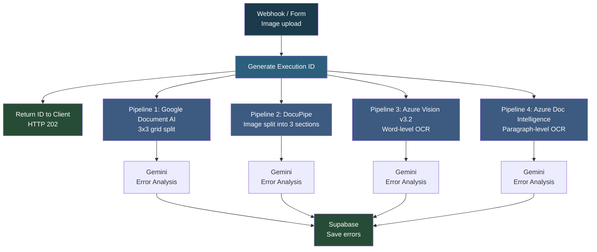

# Clear AI Flow - Multi-Engine OCR Error Detection

## Overview

This is the **production OCR error detection system for ClearAI Vision**. It runs four parallel OCR processing pipelines using different engines (Google Document AI, DocuPipe, Azure Vision v3.2, and Azure Document Intelligence) to extract text from packaging images, then uses Google Gemini AI to detect spelling, grammar, punctuation, spacing, and consistency errors. It returns an execution ID immediately so the frontend can poll for results, and stores all detected errors in Supabase.

## How It Works

```
Webhook/Form -> Generate Execution ID -> Return ID to Client -> Run OCR Pipelines in Parallel -> Gemini Error Analysis -> Save to Supabase
```

### Workflow Diagram



### Workflow Steps

**Pipeline 1 - Google Document AI:**
1. Converts image to base64, splits into 3x3 grid (9 sections).
2. Sends each section to Google Document AI for OCR.
3. Combines all extracted text and sends to Gemini for error analysis.
4. Saves errors to Supabase.

**Pipeline 2 - DocuPipe:**
1. Splits image into 3 sections, sends to DocuPipe API.
2. Waits for processing, fetches detailed results with word-level bounding boxes.
3. Combines text, sends to Gemini with bbox-aware error matching.
4. Saves errors to Supabase.

**Pipeline 3 - Azure Vision v3.2:**
1. Sends image to Azure Read API, waits for async processing.
2. Extracts all words and sends to Gemini with a detailed packaging-specific prompt.
3. Filters out false positives (errors marked as "Correct").
4. Saves errors to Supabase.

**Pipeline 4 - Azure Document Intelligence:**
1. Sends image to Azure Document Intelligence (2024-11-30 API).
2. Extracts words with confidence scores and paragraph structure.
3. Sends to Gemini with word-level and paragraph-level error detection.
4. Saves errors to Supabase.

## Nodes

| Node | Type |
|------|------|
| Webhook / Form Triggers | Webhook (POST) / Form Trigger |
| Generate Execution ID | JavaScript Code |
| Return Execution ID | Webhook Response (HTTP 202) |
| Google Document AI | HTTP Request (Google Cloud) |
| DocuPipe | HTTP Request (DocuPipe API) |
| Microsoft Azure (x2) | HTTP Request (Azure Vision) |
| Message a model (x4) | Google Gemini 2.5 Flash |
| Parse Gemini Response (x4) | JavaScript Code |
| Add Execution ID to Errors (x4) | JavaScript Code |
| Create a row (x4) | Supabase (insert) |

## Integrations

- **Google Document AI** - OCR engine (pipeline 1)
- **DocuPipe** - OCR engine (pipeline 2)
- **Microsoft Azure Computer Vision v3.2** - OCR engine (pipeline 3)
- **Microsoft Azure Document Intelligence** - OCR engine (pipeline 4)
- **Google Gemini (2.5 Flash)** - AI error detection across all pipelines
- **Supabase** - Error storage database

## Setup

1. Import `Clear_AI_flow.json` into your n8n instance.
2. Update credentials for Google Cloud, DocuPipe, Azure Vision, Azure Document Intelligence, Google Gemini, and Supabase.
3. Ensure the `ocr_table` exists in Supabase with required columns.
4. Activate the workflow. The webhook endpoint accepts image uploads and returns an execution ID for polling results.
